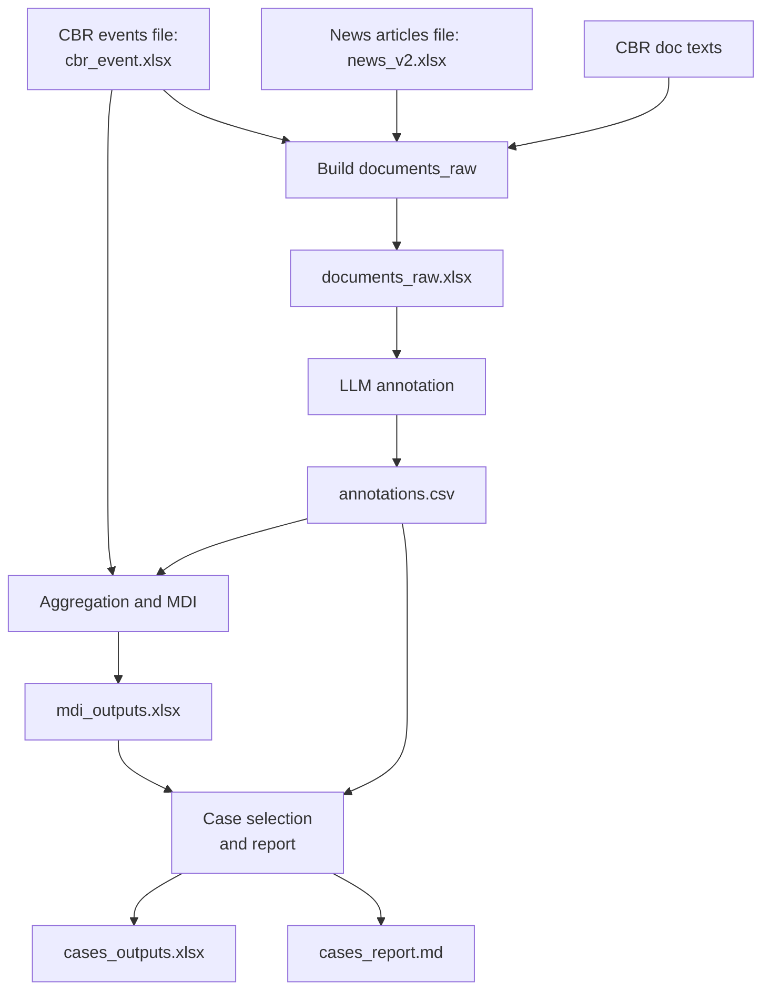

# Media Divergence Index for Central Bank of Russia (MDI)
Проект практикума по курсу **«Коммуникация центральных банков и анализ данных»**.

Задача: измерить, **насколько интерпретация решений Банка России по ключевой ставке в СМИ расходится** с официальной коммуникацией ЦБ, и автоматически собрать **кейсы расхождений** для качественного разбора.


## 1) Цель и результат

**Цель:** получить воспроизводимую event-level оценку:
- `official_stance` (сигнал ЦБ),
- `media_stance` (сигнал СМИ),
- `divergence_stance` (расхождение).

**Ключевой результат:** `data/out/mdi_outputs.xlsx` (листы `mdi_by_event`, `media_qc_by_doc`).

## 2) Данные

### На входе
По умолчанию `configs/annotate.yaml` использует `data/documents_raw.xlsx`.

Минимальные поля (через `io.columns`):
- `event_id`, `doc_id`, `source_type` (`cbr`/`media`), `source_name`
- `title`, `lead`, `text_raw` (или иной столбец, заданный в config)
- опционально `published_at`

### На выходе
- `data/out/annotations.csv` — построчная LLM-разметка документов.
- `data/out/mdi_outputs.xlsx`:
  - `mdi_by_event` — метрики по событиям,
  - `media_qc_by_doc` — Quality Check (QC): включён/исключён документ и причина.
- `data/out/cases_outputs.xlsx` — выбранные кейсы (`cases`) + документы (`docs`).
- `data/out/cases_report.md` — текстовый отчёт по кейсам.

## 3) Quickstart (полный запуск)

```powershell
# Рекомендуется Python 3.10+ (3.10/3.11)
python --version
python -m venv .venv
.\.venv\Scripts\Activate.ps1
pip install -r requirements.txt

# Авторизация GigaChat
$env:GIGACHAT_CREDENTIALS = "<ваш_секрет>"
# scope берётся из configs/annotate.yaml (по умолчанию GIGACHAT_API_PERS)

# Шаг 3
python -m mdi.annotate.run --config configs/annotate.yaml

# Шаг 4
python -m mdi.aggregate.run --ann data/out/annotations.csv --events data/documents_raw.xlsx --out_xlsx data/out/mdi_outputs.xlsx

# Шаг 5
python -m mdi.cases.run --ann data/out/annotations.csv --mdi_xlsx data/out/mdi_outputs.xlsx --max_cases 5 --out_xlsx data/out/cases_outputs.xlsx --out_md data/out/cases_report.md
```

## 4) Пайплайн (Mermaid)



## 5) Методология

### 1. Аннотация
Модель возвращает: `stance`, `strength`, `reasons`, `mentions_key_rate`, `evidence`, `notes` + техполя `status/attempts/error`.

Особенности:
- текст для LLM = `title + lead + text`, затем обрезка по `max_chars`;
- retry/backoff для сетевых/JSON ошибок;
- resume по `doc_id` (повторный запуск не дублирует уже размеченные документы).

### 2. Агрегация
Деление на `cbr` и `media`, расчёт метрик по `event_id`.

**Фильтр usable для media-документов:**
`status=ok AND mentions_key_rate=True AND stance!=irrelevant`

Исключения фиксируются в `excluded_reason`:
- `status_not_ok`
- `mentions_key_rate_false`
- `stance_irrelevant`

### 3. Кейсы
Приоритет отбора событий:
1. `divergence_stance == 1`
2. `media_stance == mixed`
3. `n_media_used < 4`

## 6) Stance и strength

### Категории `stance`
- `hawkish` — сигнал про ужесточение/жёсткость,
- `dovish` — сигнал про смягчение,
- `neutral` — направленность не выражена,
- `mixed` — есть и hawkish, и dovish без доминирования,
- `irrelevant` — нет релевантного сигнала по ставке/ДКП.

### Значение `strength`
Целая шкала `0..3`:
- 0 — почти нет сигнала,
- 1 — слабый,
- 2 — средний,
- 3 — сильный.

## 7) Формулы и интерпретация ключевых метрик

Для листа `mdi_by_event`:
- `n_media_total` — число всех media-документов события.
- `n_media_ok` — число media-документов со `status=ok` (нормально прошли аннотацию LLM).
- `n_media_used` — число media-документов, прошедших usable-фильтр.
- `media_relevance_rate` — доля `mentions_key_rate=True` среди `status=ok` media.
- `media_strength_avg` — среднее `strength` по usable media.
- `divergence_stance`:
  - `1`: `official_stance` и `media_stance` оба в `{hawkish,dovish,neutral}` и **разные**,
  - `0`: оба в том же наборе и **совпадают**,
  - `NaN`: иначе (`mixed/na/irrelevant` или пропуски).

### Как формируются `official_stance` и `media_stance`
- `official_stance`: из `source_type=cbr` после usable-фильтра (один документ на событие).
- `media_stance`: majority vote по usable media; при ничьей → `mixed`, при отсутствии usable → `na`.

## 8) Как читать выходные файлы

- `mdi_outputs.xlsx / mdi_by_event`: сначала `official_stance`, `media_stance`, `divergence_stance`; затем надёжность (`n_media_used`, `n_media_ok`, `n_media_total`, `media_relevance_rate`); затем `top_reasons`.
- `mdi_outputs.xlsx / media_qc_by_doc`: проверка причин исключения и качества покрытия.
- `cases_outputs.xlsx / cases+docs`: ручной разбор выбранных событий; в `docs` см. `is_used_in_media_signal` и `excluded_reason`.
- `cases_report.md`: короткая narrative-версия кейсов.

